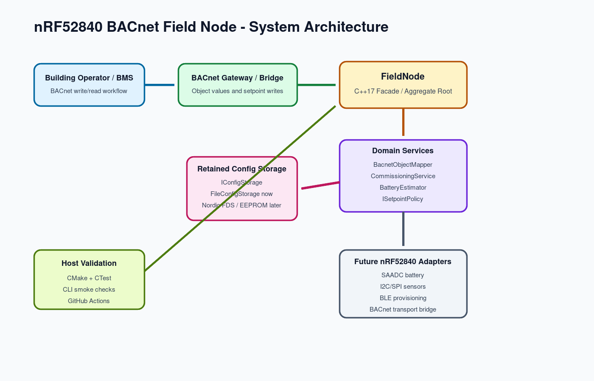
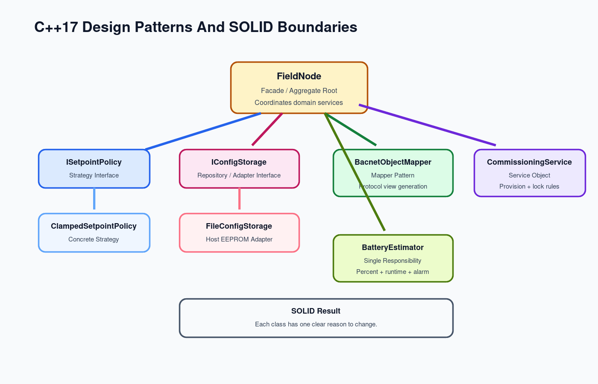
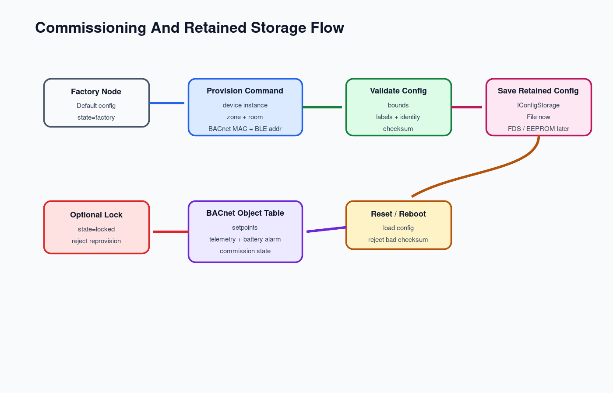

# Architecture

## Objective

Build a portfolio-ready C++17 model of an nRF52840 BACnet field node that can grow into hardware firmware while remaining testable on a normal development machine.

The project is not a toy print-only scaffold. It contains a real domain model for:

- Retained commissioning configuration.
- BACnet object mapping.
- Battery and low-power behavior.
- Writable setpoint safety.
- Host-side persistence.
- Commissioning evidence.

## System Context

```text
Building Operator / BMS
        |
        | BACnet object values, setpoint writes, commissioning state
        v
nRF52840 BACnet Field Node
        |
        | C++17 domain model
        v
Sensors, retained storage, battery, BLE/BACnet bridge
```

The host simulator stands in for hardware drivers. That lets the project prove design quality, object contracts, validation, and documentation before board-specific work begins.

## Layered Design



```text
CLI Simulator
  src/main.cpp
        |
FieldNode Facade / Aggregate Root
  config, sample, objects, commissioning report
        |
Domain Services
  CommissioningService
  BacnetObjectMapper
  BatteryEstimator
  ISetpointPolicy
        |
Infrastructure Adapters
  IConfigStorage
  FileConfigStorage
        |
Future Hardware Backends
  Nordic FDS / EEPROM
  SAADC / I2C / SPI sensors
  BLE provisioning
  BACnet gateway transport
```

## Key Types

### `FieldNode`

Coordinates retained config, live sensor sample, battery profile, commissioning, object mapping, storage, and reports. It is the main API used by CLI, tests, and future firmware integration.

### `RetainedConfig`

Represents data that must survive reset:

- Device instance.
- Vendor ID.
- BACnet object base instance.
- Setpoint bounds and retained setpoints.
- Transmit interval.
- BACnet MAC identity.
- BLE address.
- Zone and room labels.
- Commissioning state.
- Checksum.

### `BacnetObjectMapper`

Maps the current node state to a stable BACnet-style object table. It does not own config or sensor state, which keeps mapping logic testable.

### `IConfigStorage`

Abstracts retained storage. The host implementation uses a text file. A hardware implementation can write to Nordic FDS, internal flash, or an external EEPROM without changing `FieldNode`.

### `ISetpointPolicy`

Allows setpoint behavior to vary. The default `ClampedSetpointPolicy` constrains writes inside configured min/max comfort bounds.

## C++ Design Patterns



### Strategy

`ISetpointPolicy` is a strategy interface. The default policy clamps setpoints, but a future policy could apply occupancy schedules, demand response rules, or BEMS-ai recommendations.

### Repository / Adapter

`IConfigStorage` decouples the domain model from storage details. `FileConfigStorage` is the host adapter. Nordic FDS or EEPROM would be another adapter.

### Mapper

`BacnetObjectMapper` converts domain state into BACnet-facing object values. This avoids mixing building-protocol representation with application state.

### Service Object

`CommissioningService` owns provisioning and lock rules, including the rule that a locked node cannot be reprovisioned.

### Facade

`FieldNode` gives the CLI and tests a simple facade over several internal services.

## SOLID Design Notes

- `BatteryEstimator` only estimates battery state.
- `BacnetObjectMapper` only builds BACnet object views.
- `CommissioningService` only changes commissioning state.
- `FileConfigStorage` only persists and loads config.
- `FieldNode` coordinates these objects instead of doing every job itself.

## Future Firmware Mapping

| Current Host Type | nRF52840 Firmware Counterpart |
| --- | --- |
| `FileConfigStorage` | Nordic FDS, flash page storage, or external EEPROM |
| `SensorSample` | SAADC/I2C/SPI/BLE sensor reads |
| `BacnetObjectMapper` | BACnet gateway payload table |
| `CommissioningService` | BLE provisioning characteristic handler |
| `main.cpp` CLI | RTOS task, Zephyr shell, or Nordic app main |
| CTest | Host unit tests plus HIL smoke tests |

## Safety Boundaries



- Setpoint writes are clamped.
- Config checksum must match before load succeeds.
- Locked nodes reject reprovisioning.
- Sensor sample ranges reject impossible values.
- Low-battery state is exposed as a BACnet binary value.
